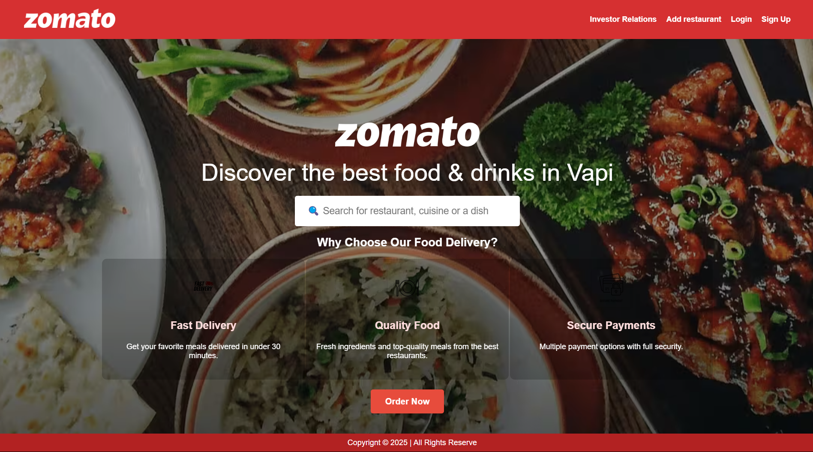
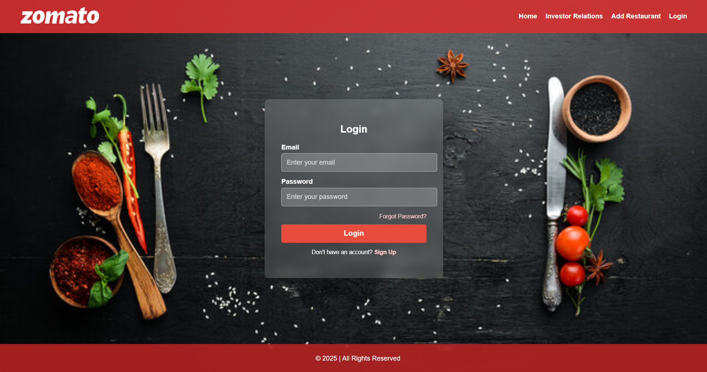

# 🍽️ Zomato Clone

This is a basic HTML, CSS, and JavaScript project that replicates the core structure and design of Zomato's website. It includes multiple static pages like Home, Login, Signup, Investor Relations, and Add Restaurant.

---

## 🖼️ Screenshots

### 🔹 Home Page


### 🔹 Login Page


---

## 📁 Project Structure

```
zomato-clone/
│
├── index.html               # Home page
├── login.html               # Login page
├── signup.html              # Signup page
├── investor.html            # Investor Relations page
├── add-restaurant.html      # Add Restaurant page
│
├── css/
│   └── style.css            # Main stylesheet
│
├── js/
│   └── script.js            # JavaScript functionality
│
└── screenshots/             # Project screenshots
```

---

## 🚀 Features

- Responsive homepage design
- Login and Signup pages with input validation (basic)
- Investor Relations static content
- Add Restaurant form structure
- Organized folder structure for scalability

---

## 🛠️ Built With

- **HTML5**
- **CSS3**
- **JavaScript (Vanilla)**

---

## 📌 How to Use

1. Clone this repository:
   ```bash
   git clone https://github.com/your-username/zomato-clone.git
   ```

2. Navigate into the project folder:
   ```bash
   cd zomato-clone
   ```

3. Open `index.html` in your browser to view the homepage.

---

## 💡 Future Improvements

- Add backend integration for authentication and data submission
- Use a CSS framework (e.g., Bootstrap or Tailwind)
- Make all pages fully responsive
- Implement search and restaurant listing functionality

---

## 📬 Contact

[](mailto:jaydhodi14@gmail.com)
[](https://www.linkedin.com/in/jaydhodi14/)

---

## 📄 License

This project is for educational purposes only. It is not affiliated with Zomato.
```

Let me know if you want me to auto-generate image placeholders or give you a version with embedded base64 images for offline display.
 
